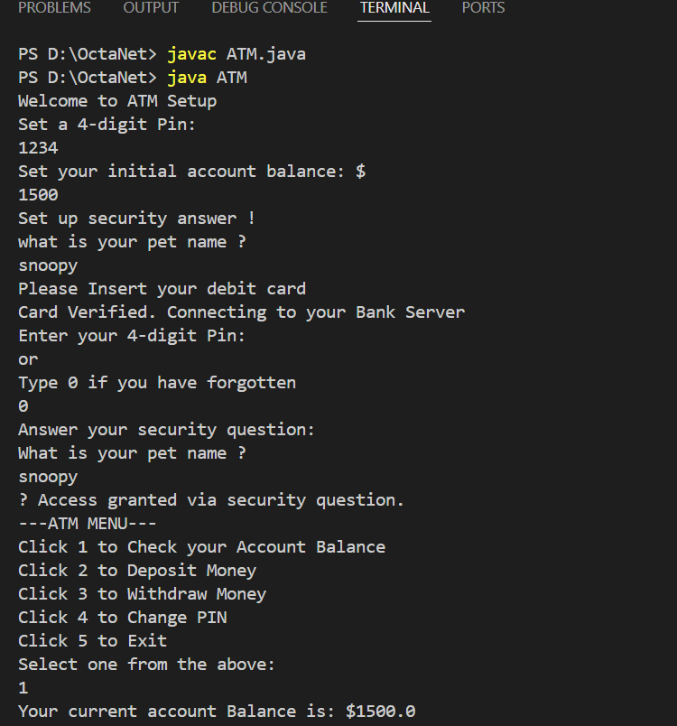
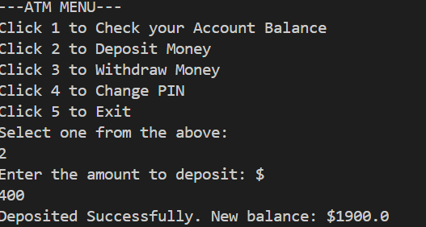
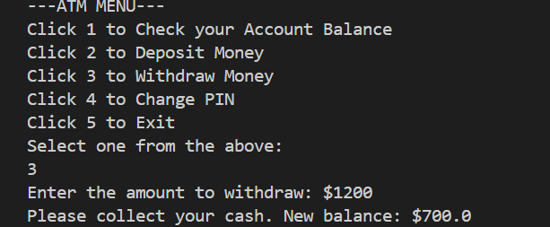
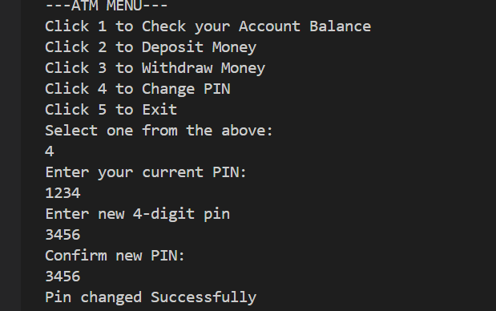
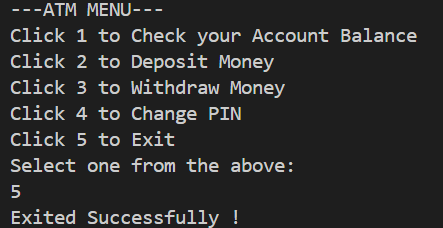

🏦 ATM Machine Simulation (JAVA)

This project simulates a basic ATM machine using Java. It allows users to interact with an ATM-like interface via the terminal, performing common banking operations such as:
1. ✅ PIN verification & security question recovery.
2. 💰 Balance inquiry.
3. ➕ Deposit money.
4. ➖ Withdraw money with balance check.
5. 🔏 Change PIN securely.
6. ❌ Exit Session.

This project includes features like dynamic PIN setup, initial balance input, and a security question fallback if the PIN is forgotten.

## Sample Output

**Balance Check**

**Deposit Money**

**Withdraw Money**

**Change PIN**

**Exit**

